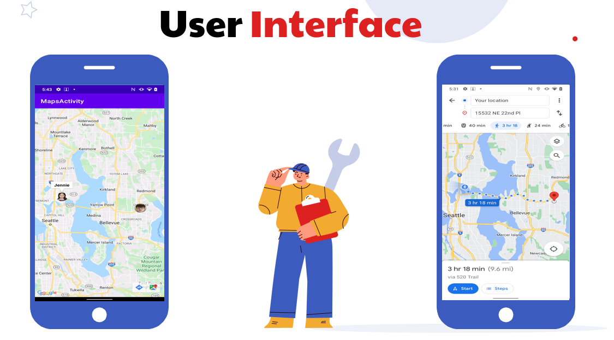
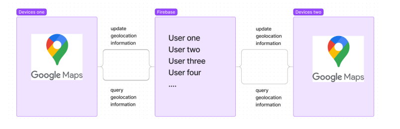
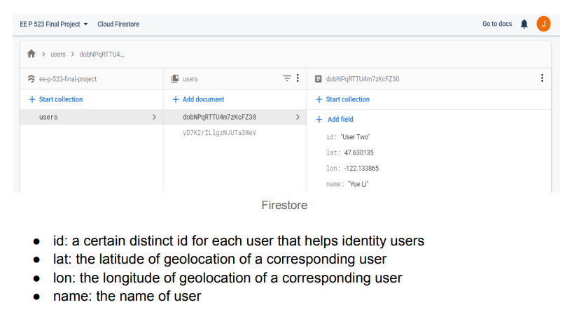

# live-share-location

## Overview

I built a simple live locations sharing android app

## Main functionality
- The project will be implemented within two devices. Our app enables users to
share geolocation with each other. All information will be displayed on google
map.
- Specifications include:
1. Up to 2 users sharing locations simultaneously
2. Customized markers will be displayed on map
## User Interface

- Two icons: one icon is referring to userOne and the other is userTwo. The icon
will be displayed with map functionality, so that each icon will be considered as
the current location of each user.
- Map: a full-screen map will be displayed to help users with locating them

## Project Structure

## Data management
- All data that matters is stored by the User class. User is a customized class and
there will be two objects generated during the implementation for our two users.
Firebase will be the cloud database that stores all information of users. During
the process, the app will fetch each user’s data from Firebase, and interact with
UI.

